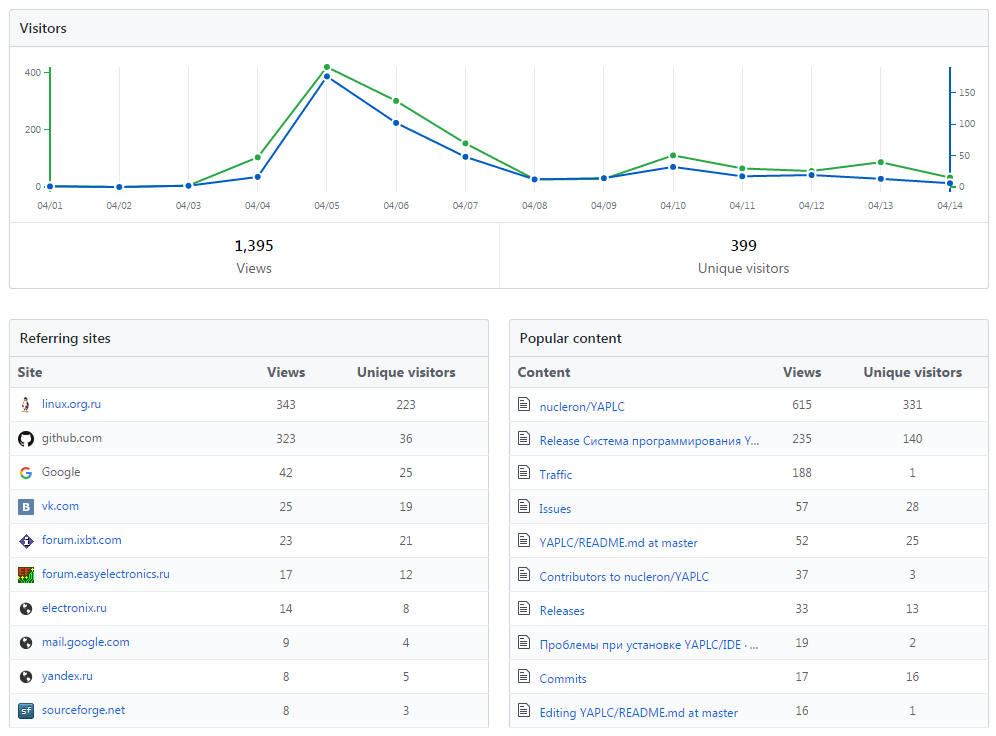

# Проект, часть вторая.
Предыдущая часть [здесь](../story_1.md).

## Как я играл(ся) в маркетолога
В прошлой части не была раскрыта тема вывода продукта моего проекта на рынок, думаю, что надо восполнить этот досадный пробел.
Итак, продукт представляет собой программно-аппаратный комплекс, предназначенный для промышленного и бытового применения, соответственно, комплекс маркетинговых мероприятий включал в себя:

 * сертификацию приборов комплекса по ТР ТС;
 * комплекс рекламных мероприятий (участие в отраслевой выставке и прочая реклама);
 * выявление и устранение несоответствий между потребностями конечного потребителя и нашими о них представлениями;

Первые два пункта стандартны и скучны, хотя и отбирают у меня довольно много времени прямо сейчас. 
Третий пункт с моей точки зрения более интересен, о нем я и расскажу.

Для того, чтобы заняться выявлением и устранением недостатков продукта с точки зрения конечного потребителя нужно:

  * вычленить из всей массы потребителей наиболее активную часть, способную оказать помощь проекту;
  * привлечь её внимание;
  * вовлечь в работу по улучшению продукта.
  
После того как лучшие представители оказались вовлечены в проект, нужно эффективно отрабатывать их запросы на изменения, не забывая о целесообразности и реализуемости таких изменений.

### Целевая группа
В нашем случае целевой группой являются конечные пользователи программно-аппаратного комплекса, обладающие следующими качествами:

  * социальная активность;
  * любопытство;
  * склонность к творчеству;
  * готовность тратить своё личное/рабочее время на изучение продукта;
  * техническая грамотность;

В поисках нужных мне людей, я стал <del>изучать различные интернет-ресурсы</del>, хотя, кого я обманываю, я сам обитаю на ресурсах, где есть любопытные, творческие, грамотные люди, мне не пришлось долго искать. Я с самого начала знал, где найти нужных людей.

### Как вы судно назовете...
Однако знание мест не отменяет необходимости привлечь внимание нужных людей. 
Для привлечения внимания нужно прежде всего имя. Имя должно быть коротким, запоминающимся, позитивным, мы же не хотим, чтобы ваш продукт ассоциировался у потребителя с какой-нибудь гадостью!

И да, имя кораблю лучше дать до того, как он сойдет со стапелей... Иными словами, когда начнутся продажи, у вас уже должен быть узнаваемый бренд. 

Имя, как и в случае с [BuguRTOS](https://github.com/shkolnick-kun/bugurtos), я выбрал хлесткое, меметичное, с множественными смыслами. Не буду его пока раскрывать, но скажу, что аудитория его оценила по достоинству.

### Я хочу посмотреть, какая ты изнутри...
Ради чего люди готовы пожертвовать своим временем? Особенно если аналоги того, что ты им предлааешь, уже есть на рынке, и их делают международные корпорации, которые уже "подсадили" людей на свои продукты? 

Правильно, ради удовлетворения высших потребностей: самореализации, творчества и т.д.. А ещё из любопытства, желания помочь ближнему, в общем, причин может быть масса, вплоть до желания конкурентов <del>обосрать</del> дискредитировать твой продукт.

А как нам удовлетворить эти потребности?

Правильно - дать человеку продукт и дать ему посмотреть, как наш продукт устроен изнутри.

Именно поэтому программная часть комплекса была открытой с самого начала. 
Эта открытость позволяла дать позитивно настроенным людям возможность удовлетворить любопытство, поэкспериментировать с продуктом, сообщить нам о выявленных недостатках. 

В последнем случае у конкурентов появляется отличная возможность поработать над улучшением нашего продукта путем выявления в нем недостатков. В этом случае наша задача - оперативно устранять выявленные недостатки.

### Потыкай его палочкой...

Исходя из вышеизложенных соображений на старте проекта были я принял следующие меры:
 * выбрал **правильное** имя проекта;
 * решил, что проект будет открытым;
 * решил устроить акцию по привлечению **правильных** представителей целевой аудитории и по тестированию продукта их силами.
 
 Суть акции сводилась к: размещению на одном из интернет-ресурсов информации о проекте и приглашение желающим принять участие тестировании продукта; раздаче образцов приборов; получению и обработке обратной связи от тестеров.

В результате размещения информации мне удалось привлечь внимание порядка четырехсот человек, из них одиннадцать человек выразили готовность протестировать продукт. Из них двое пришли к нам от конкурентов. В итоге девять тестеров получили приборы. 

Эффективность акции на данном этапе составила 2%, что ниже средней эффективности маркетинговых акций коммерческих интернет-проектов (3%). Читатель может возразить, мол "ты ничего не продаешь", но это не так, как я уже говорил, - люди потратили на наш проект свое личное или даже **рабочее** время, а время - деньги.

Из девяти человек, получивших приборы по этой акции, обратную связь дали пять, т.е. в итоге эффективность акции составила около 1%, много это или мало - не знаю, у меня не было раньше подобного опыта.

## Эпилог
После написания первой части прошло какое-то время. 

Как я и писал тогда, я начал рефакторинг одной из библиотек, использованных в проекте, но понял, что рефакторингом не обойтись, пришлось реинженерить...

На начале сентября 2017 я планировал релиз продукта, но в самый последний момент нашел очень нехорошие места в чужом коде, возможно, - придется делать релиз без одного из приборов комплекса.

Продолжение следует...

Copyright (C) 2017 anonimous (shkolnick.kun@gmail.com)
