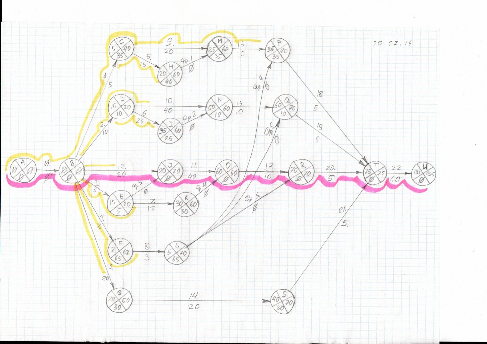

# Будни сизифа, или «почему разработки идут так долго».

Я работаю в небольшой приборостроительной компании и занимаюсь
разработкой и производством радиоэлектронных приборов и аппаратуры. В
мои обязанности входит в том числе управление проектами разработок,
кроме того мне иногда приходится принимать непосредственное участие в
моих проектах.

Обычно в моем портфеле порядка 10 — 15 проектов разработок, из которых
три — пять находятся на различных стадиях реализации, а остальные — на
стадиях рассмотрения, инициации, планирования.

Иногда от вышестоящего начальства я слышу вопросы типа: «Почему
разработки идут так долго?»

В этом эссе я попытаюсь раскрыть тему «затягивания сроков» на примере
одного из проектов, который я заканчиваю в настоящий момент.

Проект
======

Проект представляет собой разработку и запуск в производство
программно-аппаратного комплекса, включающего четыре прибора для трех из
которых нужно разработать встроенное программное обеспечение, а так же
программное обеспечение для персонального компьютера для работы с
приборами.

Идея проекта возникла весной - летом 2014 года, когда санкции и
значительное изменение курса валют открыли рыночные ниши, на которые
раньше было попасть невозможно из-за дешевого импорта.

Однако импортозамещением занялись не только мы, но и государство в
целом, загрузка оборонных предприятий возросла, и им потребовались
квалифицированные кадры. В результате оттока людей в оборонный сектор
проект пришлось отложить на полтора года. На тот момент был готов
прототип первой версии.

Структура работ
---------------

На рис. 1 показан сетевой граф работ по проекту:

*Рис. 1 Укрупненная структура работ проекта*

В данном случае структура работ показана очень «крупно»: например,
описание работ 1, 5, фр. 1, 9,15, 18 и их взаимосвязей в виде диаграммы
ARIS занимает одну сторону листа в формате А1.

Проект включает в себя следующие работы: прототипирование (0),
разработку принципиальных схем приборов (1, 2, 3, 4), разработку
конструкции приборов, в том числе — их печатных плат, (5, 6, 7, 8),
разработку встроенного ПО (9, 10, 11, 12) и его отладку на приборах (15,
16, 17), разработку ПО персонального компьютера (13, 14), разработку
документации (18, 19, 20, 21), мероприятия по выводу комплекса на рынок
(20). Трудоемкости работ даны в рабочих сменах под стрелками.
Критический путь обозначен фиолетовой линией. Выполнение работ
обозначено желтыми линиями.

План проекта строился в июне 2016 года, на тот момент была готова
**вторая** версия прототипа, соответственно её трудоёмкость не
учитывалась при планировании.

При условии полного комплектования проекта разработчиками разработки по
проекту могли быть закончены не раньше середины октября 2016 года.

Потребности в человеческих ресурсах
-----------------------------------

Итак, проект включал в себя в общей сложность 290 смен работы
разработчиков и 60 смен комплекса маркетинговый мероприятий. На
критическом пути было 75 смен разработки, это в 3,86 раза меньше общего
объема разработки, т. е. для реализации подобного проекта без отставания
по срокам было необходимо не менее четырех разработчиков-универсалов,
которые могут как разрабатывать изделия так и писать для них ПО и
документацию.

Понятно, что в реальном мире не все люди взаимозаменяемы, поэтому
необходимо оценить потребности проекта с точки зрения задействования
узких специалистов. С учетом специализации мы имеем следующие объемы
работ специалистов:

1.  **Разработка принципиальных схем** приборов: всего 22 рабочих смены;
    резервы времени позволяют выполнить работы **двумя** специалистами в
    последовательности: (3, 1, 4) || 2, объем работ можно сократить,
    если использовать общее аппаратное ядро в работах 3 и 2 (такая
    возможность была, т. к. приборы были похожи), после чего работы
    можно выполнить в последовательности 3, 2, 1, 4; таким образом,
    **нужен один инженер-схемотехник.**
2.  **Разработка конструкции** приборов: всего 55 рабочих смен, резервы
    времени позволяют выполнить работы **двумя** специалистами в
    последовательности: (7, 5, 8) || 3, продолжая идею общего аппаратно
    ядра, можно использовать одни и те же процессорный модуль и корпус
    на двух приборах, соответственно работы можно выполнить одним
    специалистом в последовательности 7, 6, 5, 8; таким образом, **нужен
    один инженер-конструктор.**
3.  **Разработка встроенного программного обеспечения** приборов:
    **общее программное ядро** для всех приборов было написано при
    создании прототипа второй версии; общий объем работ по встроенном ПО
    : 150 смен, из них 70 на критическом пути; объем работ на
    критическом пути меньше общего объема работ в 2,1 раза, то есть для
    реализации проекта **нужно** на разных этапах **задействовать** в
    написании встроенного ПО **от двух до трёх человек.**
4.  **Разработка программного обеспечения** персонального компьютера:
    объем работ 40 смен, резервы времени позволяют выполнить работу
    **одним программистом**. Работы организованы в две очереди (13 и
    14 соответственно).
5.  Разработка документации включает в себя разработку паспортов
    приборов и руководств по эксплуатации на приборы и ПО, изначально
    предполагалось, что документация на ПО будет иметь минимальный
    объем, т. е. описание особенностей используемого ПО применительно к
    нашим изделиям, предполагалось, что разработчики сами будут
    писать документацию.

**Итого**, для реализации проекта с минимальным отставанием от сроков
нужно **от пяти до шести человек** в зависимости от степени их
взаимозаменяемости.

Человеческие ресурсы
====================

Способность организации выполнять разработки определяется наличием
людей, обладающих определенными знаниями, навыками и желанием применять
эти знания и навыки в интересах организации. При выполнении данного
проекта в моем распоряжении были:

1.  инженер-универсал с уклоном в схемотехнику, то есть он может
    разрабатывать схемы, конструкцию, документацию, встроенное ПО, но
    основная деятельность — схемотехника и нижние уровни встроенного ПО;
2.  инженер-конструктор, основная специализация — разработка печатных
    плат, но может разрабатывать и общую конструкцию приборов;
3.  я — могу заместить любого специалиста на предприятии в том числе все
    рабочие специальности, иногда бывает возможность тратить до 50%
    времени на разработку, как разработчик специализируюсь на
    схемотехнике и встраиваемых системах;

Таким образом, на начальном этапе проекта был дефицит разработчиков:
нужно было привлечь одного программиста для разработки ПО персонального
компьютера и одного программиста встраиваемого ПО.

Общая ситуация на рынке труда
-----------------------------

Способность организации привлечь человеческие ресурсы определяются рядом
объективных и субъективных факторов, главным объективным фактором
является емкость соответствующего сегмента рынка труда.

Согласно \[1\] доля специалистов по встраиваемым системам среди
пользователей stackoverflow.com составляет 9,3%, при этом уровень
зарплат, как правило, выше среднего, либо самый высокий на рынке.

Мне не удалось найти результатов аналогичных опросов по РФ, но поиск
по известному порталу, посвященному рынку труда, говорит нам о
следующем: вакансий разработчиков встраиваемых систем в РФ \[2\] нашлось
порядка 200, это **значительно меньше**, чем, например, порядка 4000
вакансий разработчиков на Java \[3\] или порядка 2500 на Python
\[4\].

**Фактически емкость рынка труда РФ для разработчиков встраиваемых
систем в процентах в 3-4 раза ниже, чем целом по миру**.

**Уровень зарплат в РФ так же ниже:** если в США web-разработчик получает
порядка 90% зарплаты разработчика встраиваемых систем \[1\], то в РФ
зарплата, например, разработчика на Python (а это прежде всего — web)
примерно на 10-15% выше.

Таким образом, складывается ситуация, при которой, с одной стороны
трудно найти специалиста, а с другой — по большей части подобные
специалисты не востребованы на рынке труда, соответственно молодежь с
неохотой выбирает для себя карьеру разработчика встраиваемых систем.

«Оборонка» как кадровый пылесос
-------------------------------

Ситуация с недостатком кадров усугубилась после 2014 года, когда
оборонные предприятия, нуждаясь в специалистах, оттянули кадры из
гражданского сектора.

От своих коллег в «оборонке» я слышал, что людей на военные заводы
«выдергивали» даже из банковского сектора…

При этом государственная программа вооружений была рассчитана на период
до 2020 года, при этом срок обучения специалиста или магистра составляет
пять — шесть лет.

Таким образом, потребности оборонных предприятий имели краткосрочный
характер и не могли создать устойчивый спрос на разработчиков
встраиваемых систем, который мог бы привести к росту количества молодых
специалистов на рынке труда.

Привлеченные ресурсы
--------------------

Через знакомых мне удалось привлечь к проекту двух недостающих
специалистов:

1.  программист встраиваемых систем на свободное от работы время,
    талантливый молодой специалист, семьи нет, фактически может тратить
    на проект пару часов в рабочие дни (0,25 ставки) и всю субботу (0,2
    ставки), то есть, его фактические возможности составляют
    0,45 ставки.
2.  программист общего назначения, мой ровесник, есть семья, может
    тратить на проект субботу, то есть, его фактические возможности
    составляют 0,2 ставки.

Ход проекта, результаты и выводы
================================

С имевшимися в наличии ресурсами реализовать проект в срок не
представлялось возможным. По количеству в проект был укомплектован
минимально, однако, с учетом качества был дефицит разработчиков.

Прогноз отставания от сроков реализации проекта
-----------------------------------------------

Как было сказано выше, минимальные потребности проекта составляли:

1.  один инженер-схемотехник;
2.  один инженер-конструктор;
3.  2,1 программистов встраиваемых систем;
4.  один программист общего назначения.

Фактические ресурсы, задействованные в проекте:

1.  один инженер-схемотехник;
2.  один инженер-конструктор;
3.  я (0,5 ставки) + внешний программист (0,45 ставки), всего 0,95
    разработчика встраиваемых систем;
4.  0,2 программиста общего назначения.

В качестве технического писателя в конце проекта я планировал
использовать инженера схемотехника, имевшихся резервов времени должно
было хватить для составления паспортов и руководств по эксплуатации.

Внешнего программиста встраиваемых систем я задействовал на критическом
пути, с тем, чтобы он мог сосредоточиться на одном приборе и не
переключаться между задачами, мне оставалось сделать ПО двух других
приборов.

В итоге, получаем следующие поправки в оценку сроков выполнения проекта:

1.  1.  критический путь до работы 22, разработка и отладка встроенного
        ПО: 70/0,45 = 156 смен, отставание от первоначальных сроков
        сроков 86 смен или около четырех месяцев;
    2.  остальные работы по разработке и отладке встроенного ПО
        приборов: 80/0,5 = 160 смен, отставание от первоначальных сроков
        80 смен, с учетом резервов времени — отставание 75 смен, то
        есть, около трех месяцев;
    3.  разработка ПО персонального компьютера: 40/0,2 = 200 смен,
        отставание от первоначальных сроков 160 смен, с учетом резервов
        вренени — отставание 130 смен, то есть, около шести месяцев.

Таким образом, проект мог быть выполнен в полном объеме **с отставанием
в шесть месяцев**, при этом отставание работ на критическом пути могло
составить четыре месяца.

Реальный ход проекта
--------------------

Ход проекта представлен на рис. 2:

*Рис. 2 ход работ по проекту*

В процессе выполнения проекта внешние программисты периодически
пропадали из моего поля зрения в связи с «авралами» на основной работе.

Один из приборов, прошивки которых должен был писать я, имел довольно
мало отличий от прототипа, поэтому мне удалось быстро написать его
прошивку.

Второй имел много общего с прибором, прошивку которого разрабатывал
другой программист, поэтому у меня была возможность сосредоточиться на
отличительных особенностях «моего» прибора, к тому же, наш
инженер-схемотехник помог мне с нижними уровнями прошивки.

Как только второй программист встраиваемых систем закончил «общие» для
двух прошивок модули, я смог провести их рефакторинг, закончить
кодирование и перейти к тестированию и отладке прибора. Таким образом к
началу ноября 2016 г. мой участок работ формально был близок к
завершению. За счет повторного использования кода почти удалось
сократить отставание до примерно полутора месяцев, однако в самом конце
тестирования я выявил недостаток в схеме прибора, в результате чего
потребовался новый вариант схемы, окончание работ перенеслось на
следующий год...

Программист общего назначения работал с отставанием в пределах прогноза,
в начале ноября он сообщил мне о скором увеличении нагрузки на основной
работе на несколько месяцев вперед, поэтому я решил урезать часть
функционала: работы были завершены в середине ноября с ограничением
функционала ПО и отставанием от графика в четыре месяца.

Работы на критическом пути шли до конца марта, программист периодически
«авралил» на основной работе днями и иногда - неделями, отставание
составило пять с половиной месяцев, что на полтора месяца выше прогноза.
После окончания работ я изучил код, обнаружил недостатки в архитектуре
одной из библиотек и пришел к выводу, что нужен её большой рефакторинг,
причем сделать его лучше самому.

Как только были были устранены недостатки в схеме, и были готовы
документы на наиболее «показательный» прибор комплекса, я принял решение
начать работы по выводу комплекса на рынок и создать резервы времени на
написание документации на другие приборы комплекса.

В данный момент идет работа по выводу комплекса на рынок, начало продаж
запланировано на осень 2017 года.

Помимо работ, запланированных изначально, потребовались дополнительные
работы по обеспечению поддержки приборов и ПО в течение их жизненного
цикла, например, была осознана необходимость автоматизированной сборки
ПО и прошивок приборов, эти работы шли параллельно с выводом комплекса
на рынок.

Выводы
------

По результатам изучения хода проекта я пришел к следующим выводам:

1.  При выполнении проектов необходимо оценивать количество и качество
    имеющихся в наличии и привлеченных ресурсов, выполнение проекта в
    срок возможно только при наличии достаточного количества
    квалифицированных разработчиков и наличии у них достаточного времени
    на проект.
2.  Работы на критическом пути проекта следует выполнять
    внутри организации.
3.  Компоненты ПО, где требуется проработка архитектуры, следует
    выполнять внутри организации, т. к. сторонний разработчик может не
    иметь достаточного времени на проработку архитектуры.
4.  Задержки работ по проекту могут оказать положительное влияние на
    продукт: если бы не было задержек на критическом пути, то недостатки
    аппаратной части могли бы проявится на эксплуатации после запуска
    приборов в серийное производство.
5.  При планировании работ следует иметь в виду не только жизненный цикл
    проекта, но и жизненный цикл продукта, возможности организации по
    обеспечению жизненного цикла продукта.
6.  И да, не стоит экономить на разработчиках: количество денег, которое
    в итоге будет потрачено от этого не уменьшится, а сроки
    будут затянуты.

Ссылки
======

1.  <https://insights.stackoverflow.com/survey/2017>
2.  <https://hh.ru/search/vacancy?text=embedded&clusters=true&enable_snippets=true>
3.  <https://hh.ru/search/vacancy?text=java&only_with_salary=false&enable_snippets=true>
4.  <https://hh.ru/search/vacancy?text=python&only_with_salary=false&enable_snippets=true>

Copyright (C) 2017 anonimous (shkolnick.kun@gmail.com)

